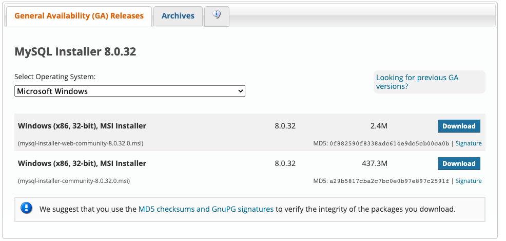
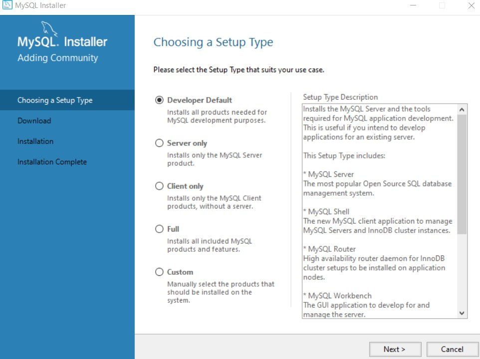
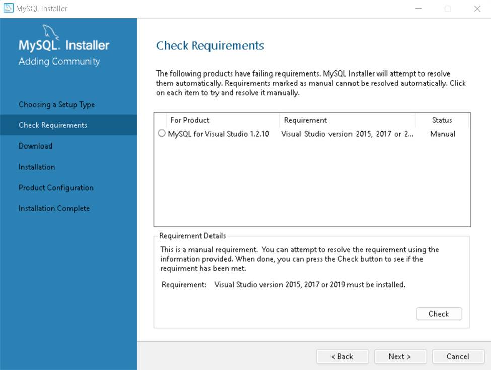
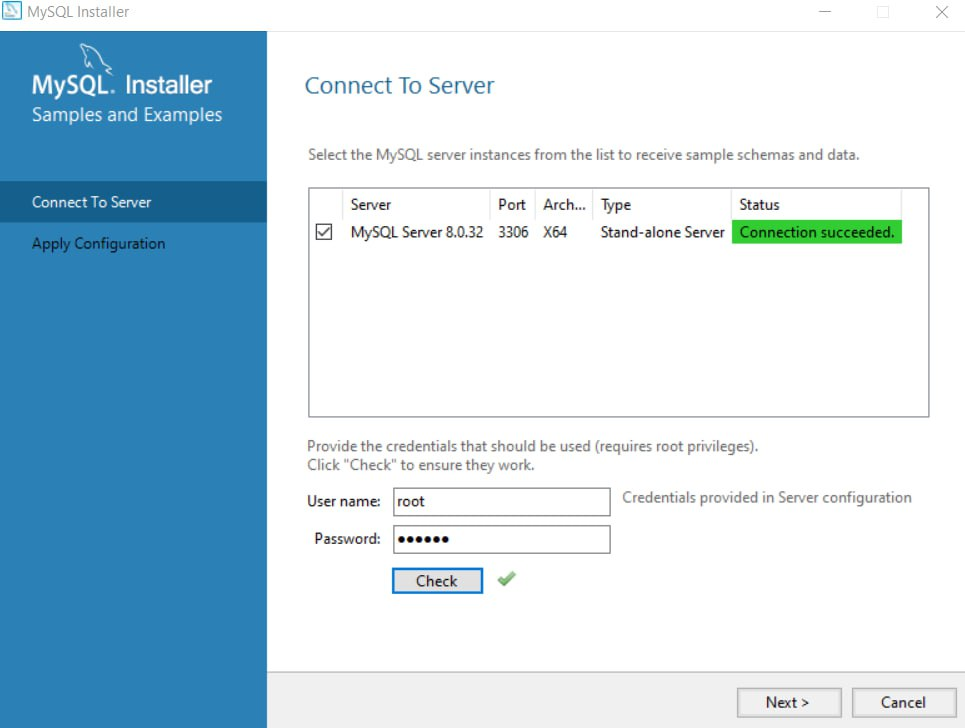
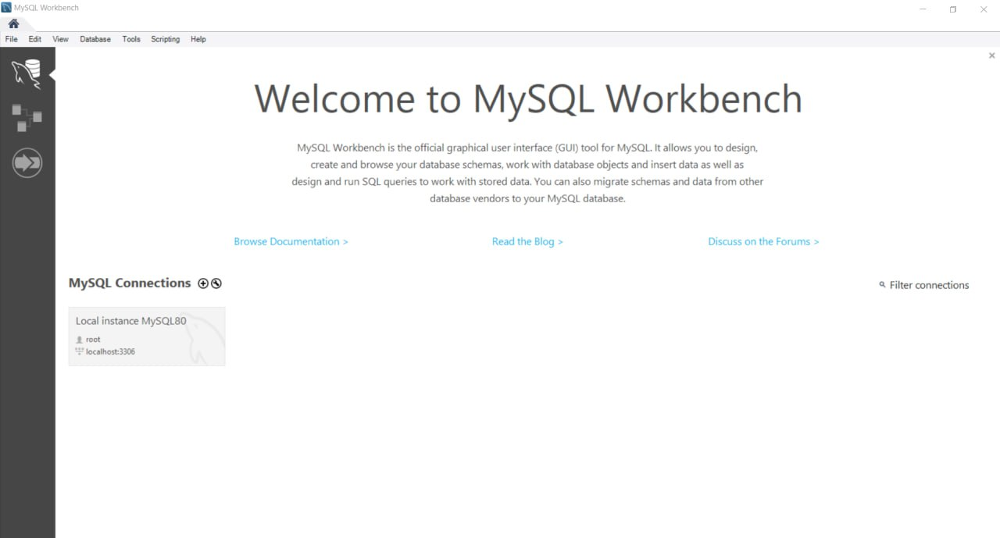
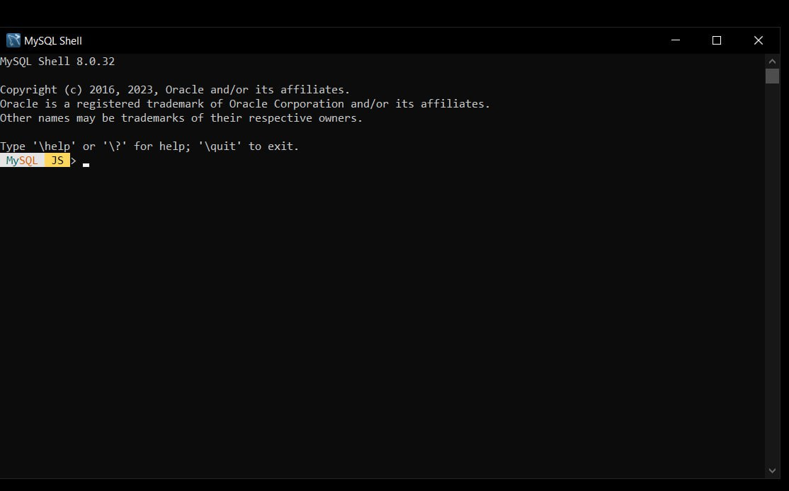
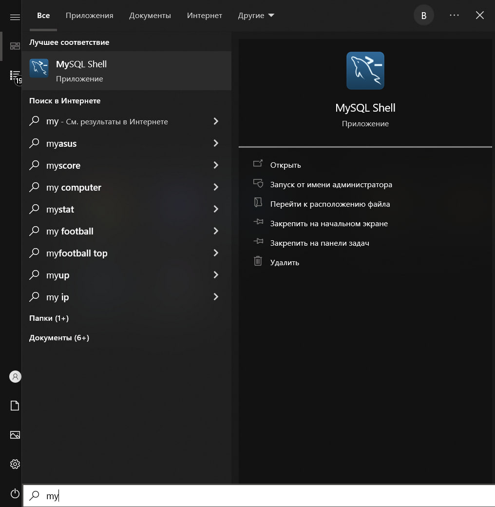

# Інструкція інсталювання MySQL на Windows 10

У гуглі пишемо `mysql install` та переходимо за першим посиланням, це має бути офіційний сайт mysql.

Якщо не знайшли: [Download MySQL](https://dev.mysql.com/downloads/installer/)

Серед двох пропозицій обираємо ту яка більша за об'ємом - це прискорить інсталювання та буде простіше.

Після завантаження файлу, запускаємо та чекаємо.

Має відкритись вікно. Обираємо Developer Default серед пропозицій та натискаємо next:

Якщо наступним пунктом буде висвітиться попередження про відсутність, наприклад, Visual Studio для MySQL, проконсультуйтесь з викладачем про потребу в цій функції, й потім або встановіть те що потребує інсталлер та нажміть кнопку check удостовіритись що інсталлер бачить потрібні йому програми та файли, або натискайте next та погоджуйтесь з попередженням.

У наступному віконці натискаємо Execute та чекаємо, натискаємо Next коли закінчиться процес.

Ще раз натискаємо Next.

У наступному вікні конфігурацій переконайтесь що обран тип налаштування Development Computer та немає попередження про зайнятість порту

Далі вам треба буде обрати метод для аутентифікації
Залишаємо рекомендований варіант, тобто Use Strong Password Encryption^

У наступному вікні создаємо пароль та йдемо далі, не створюючи юзера.
Наступні вікна пропускаємо та завершуємо.

Якщо висвітиться ось таке вікно вводимо пароль який ми створили та натискаємо check
Після цього можна йти далі.

Ось і все, встановлення закінчено.

Для роботи вам потрібна отака консоль mysql:

Для її запуску оберіть її в меню:

